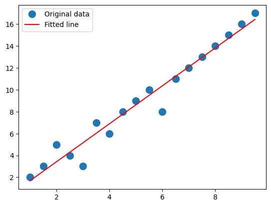
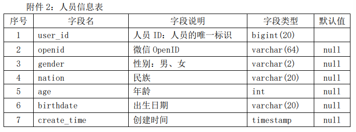
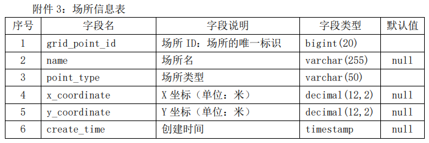
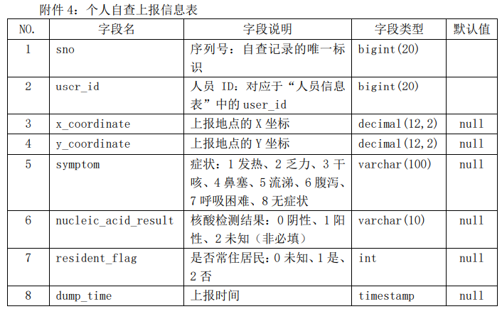
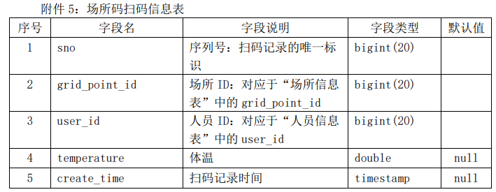
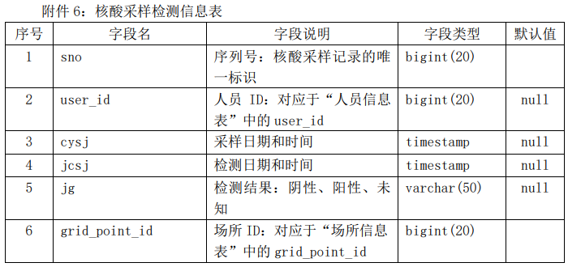
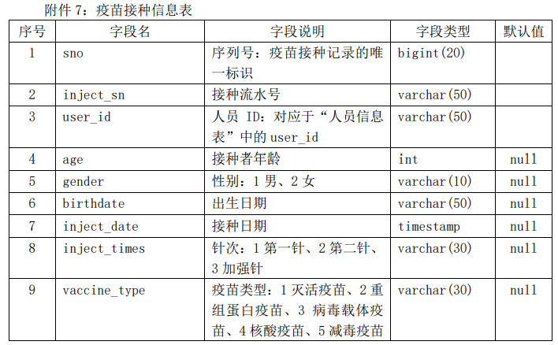

# 数据挖掘

## 简介：

数据挖掘技术是一种从大型数据集中提取有价值信息的技术。它使用机器学习，统计分析和数据库技术等技术，从原始数据中**发现**新知识，并将其**转换**为可用于决策支持的有价值信息。

## 执行步骤：

数据挖掘的基本步骤包括：**数据清洗**、**特征选择**、**建模**和**评估**。具体而言，数据清洗涉及数据缺失值替换、错误值替换、数据标准化、数据规范化和数据离散化等步骤。特征选择涉及特征筛选、特征构造和特征组合等步骤。建模涉及数据建模、模型参数调整和模型评估等步骤。最后，评估涉及评估指标选择、模型结果验证和可视化展示等步骤。

### 数据仓库：

数据仓库是一种集中**存储**和**管理**大量数据的方法，它可以让用户从不同的应用程序中收集、存储、组织和汇总数据，以便进行数据的分析和挖掘。数据仓库支持**实时数据操作**，并可以提供**统一的查询接口**，使管理员能够以最简单的方式获取所需的数据。

建立数据仓库的步骤主要有：

1. 确定数据仓库的目的，并制定实现这一目的的设计规范。
2. 收集、清洗和整理原始数据，将其转换为可用于数据仓库的格式。
3. 确定数据仓库的组织结构，并建立相应的数据模型。
4. 定义查询和分析的方法，以及使用数据仓库的用户的访问权限。
5. 选择合适的软件和数据库系统，安装和配置数据仓库。
6. 测试数据仓库，确保其正确运行。
7. 通过定期更新数据仓库，维护其可用性和准确性。

## 线性回归模型：

### 一元线性回归：

一元线性回归模型是一种最简单的统计回归方法，它是基于最小二乘法来寻找一条直线使得该直线与数据点最拟合。该直线就是一元线性回归模型，它可以用来描述两个变量之间的线性关系。

```python
import numpy as np 
import matplotlib.pyplot as plt

#生成随机数据
x = np.arange(1, 10, 0.5) 
y = np.array([2, 3, 5, 4, 3, 7, 6, 8, 9, 10, 8, 11, 12, 13, 14, 15, 16, 17])

#利用最小二乘法拟合曲线
A = np.vstack([x, np.ones(len(x))]).T 
m, c = np.linalg.lstsq(A, y)[0]
print(type(m),type(c))
#画出数据和拟合线段图
plt.plot(x, y, 'o', label='Original data', markersize=10) 
plt.plot(x, m*x + c, 'r', label='Fitted line')
plt.legend() 
plt.show()
#预测图像未来函数取值
xx = input('pls input the num you want to predict:')
xx = float(xx)
yy = m*xx + c
print('The predicted value is:',yy)
```



### 多元线性回归：

简单来讲，就是单一自变量变成多个自变量，而应变量不变，还是一个。

多元线性回归是一种统计学方法，它用于对有多个自变量的因变量（也称为因变量）进行建模。它利用多个自变量的线性组合来预测结果变量的值，这些自变量可以是相关的，也可以是不相关的。

```python
import numpy as np 
import matplotlib.pyplot as plt 

# 自拟数据
x = np.array([1., 2., 3., 4., 5.]) 
y = np.array([1., 3., 2., 3., 5.]) 

# 多元线性回归
X = np.stack([np.ones(len(x)), x], axis=1) 
w = np.linalg.solve(np.dot(X.T, X), np.dot(X.T, y)) # 系数 

# 拟合曲线
x2 = np.array([0., 6.]) 
y2 = w[0] + w[1]*x2 

# 可视化
plt.plot(x, y, 'bo', label='Original data') 
plt.plot(x2, y2, 'r', label='Fitted line') 
plt.legend() 
plt.show()
```


注：本程序中依旧是使用的一元线性回归方式来体现多元线性回归模型，可以说多元线性回归模型本身就是多个一元线性回归模型的组合。

解决想法：

在处理多元线性回归模型的时候，可以先对各个自变量进行分别处理，最后将处理结果作为新的自变量拿去处理最终的数据的时候就更加方便。

但是，需要提醒的一点就是：这种方式去处理完之后误差可能会偏大，因为中间经过了一层的误差放大，需要注意。

##  聚类分析：

把具有相似特征的数据记录聚集在一起，并以这种特征进行识别，或者对客户与数据记录进行分组的过程称为聚类。

聚类的主要步骤如下：

（1）定义距离的度量方法或任意两个个体之间的**相似性**；

（2）选择一个使用的算法并使用**距离度量**形成聚类；

（3）对分析主题给出有意义的**解释和描述**。

### 距离度量方式：

#### 1.欧几里得距离：

欧氏距离，也称为绝对距离，两点之间距离，表征这两点，或俩数据之间的绝对距离，即相应坐标的差平方之和再开方。

#### 2.曼哈顿距离：

折线距离，城市街区距离，将A点与B点的x，y，z坐标拆开相加之后的距离，即折线处必定为90度。

#### 3.切比雪夫距离：

切比雪夫距离主要表现在多维空间中，对象从某个位置转移到另外一个对象所处位置所消耗的最少距离or步数，因此可以简单地将其描述为用一维属性决定某对象属于哪个簇。

#### 4.幂距离：

不同取值下可以变成上述距离中的任意一种，当P=R时可化作**明可夫斯基距离**。

#### 5.马氏距离：

马氏距离由马哈拉诺比斯提出，表示数据间协方差距离。

马氏距离优点：

（1）不受量纲的影响，两点之间的马氏距离与原始数据的测量单位无关。

（2）由标准化数据和中心化数据计算出的两点间马氏距离相同。

（3）可以排除变量之间的相关性的干扰。

马氏距离的目的就是把方差归一化，使得特征之间的关系更加符合实际情况。

### 相似度：

#### 1.余弦相似度

#### 2.Pearson相关系数

#### 3.Jaccard相关系数

### 聚类：

1

### 重点：

**1.用密度聚类实现相关分类或预测**

**2.K均值方法种子和最佳聚类数目k的选择**


# 比赛题目

## 新冠疫情防控数据的分析：

### 一、问题背景 

自 2019 年底至今，全国各地陆续出现不同程度的新冠病毒感染疫情，如何控制疫情蔓 延、维持社会生活及经济秩序的正常运行是疫情防控的重要课题。大数据分析为疫情的精准 防控提供了高效处置、方便快捷的工具，特别是在人员的分类管理、传播途径追踪、疫情研 判等工作中起到了重要作用，为卫生防疫部门的管理决策提供了可靠依据。疫情数据主要包 括人员信息、场所信息、个人自查上报信息、场所码扫码信息、核酸采样检测信息、疫苗接 种信息等。 本赛题提供了某市新冠疫情防疫系统的相关数据信息，请根据这些数据信息进行综合分 析，主要任务包括数据仓库设计、疫情传播途径追踪、传播指数估计及疫情趋势研判等。

###  二、 解决问题 

1. 根据核酸检测中阳性人员的出行时间与场所追踪密接者，将结果保存到 “result1.csv”文件中（文件模板见附件 1 中的 result1.csv）。 

2. 由问题 1 的结果，根据密接者的出行时间与场所追踪相应的次密接者，将结果保存 到“result2.csv”文件中（文件模板见附件 1 中的 result2.csv）。 

3. 建立模型，分析接种疫苗对病毒传播指数的影响。 

4. 根据阳性人员的数量及辐射范围，分析确定需要重点管控的场所。 

5. 为了更精准地进行疫情防控和人员管理，你认为还需要收集哪些相关数据。基于这 些数据构建模型，分析其精准防控的效果。 

   注：在解决上述问题时，要求结合赛题提供的数据信息表建立数据仓库，实现数据治理 的内容，请在论文中明确阐述做了哪些数据治理工作，具体是如何实现的。

   

   ### 三、附件说明

   附件 1：

   问题 1 和问题 2 结果的文件模板（result1.csv、result2.csv） 

   附件 2：

   

   附件 3：

   

   附件 4：

   

   附件 5：

   

   附件 6：

   

   附件 7：

   